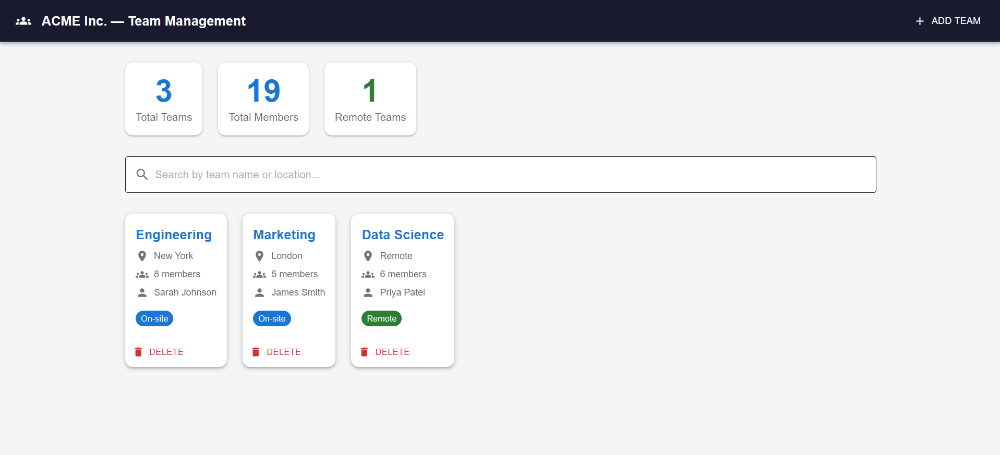

# ACME Inc. — Team Management App

A full-stack web application built to solve ACME Inc.'s team management challenges. Allows tracking of teams, members, locations, and achievements across the organization.

## Live Demo
> Run locally following the instructions below

## Screenshot


## Business Problems Solved
- View all teams and their members in one place
- Track team locations (on-site vs remote)
- See total member counts across the organization
- Add and remove teams in real time

## Tech Stack
| Layer | Technology |
|-------|-----------|
| Frontend | React.js + Material UI |
| Backend | Python + FastAPI |
| Database | MongoDB Atlas (AWS) |
| Version Control | Git + GitHub |

## Features
- Dashboard with live stats (total teams, members, remote count)
- Add new teams via form
- Delete teams
- Search and filter by name or location
- Data persisted in MongoDB cloud database

## How to Run

### 1. Start the Backend
```
cd team-management-app
python -m uvicorn main:app --reload
```
Backend runs at: http://127.0.0.1:8000

### 2. Start the Frontend
```
npm start
```
Frontend runs at: http://localhost:3000

## API Endpoints
| Method | Endpoint | Description |
|--------|----------|-------------|
| GET | /teams | Get all teams |
| POST | /teams | Create a new team |
| DELETE | /teams/{name} | Delete a team |